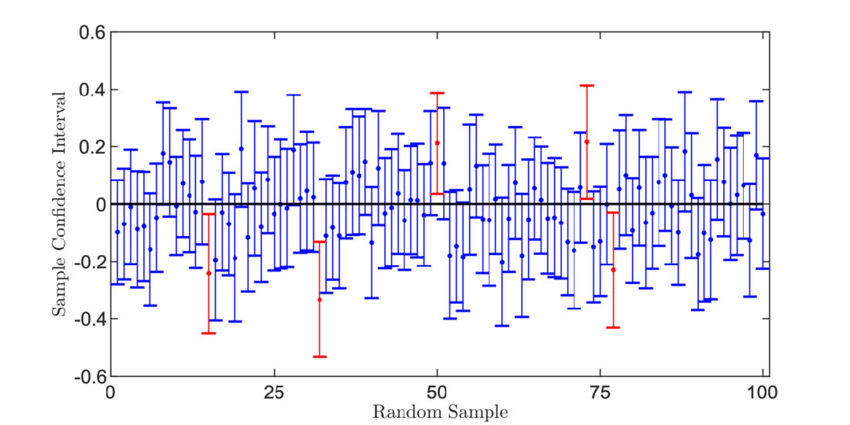
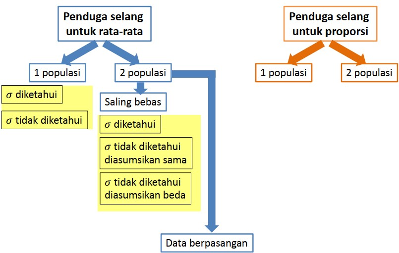
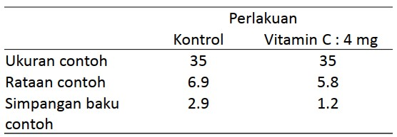
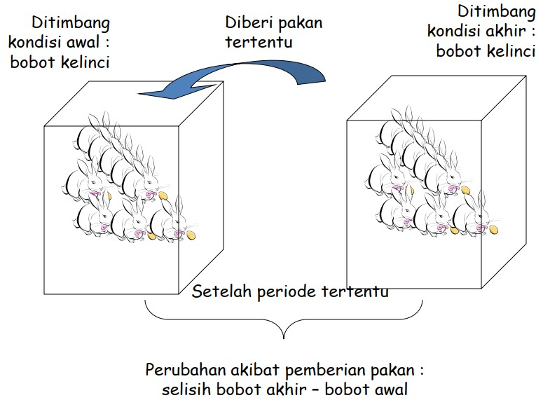
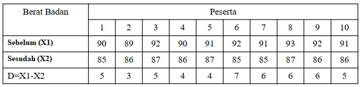

```{r xaringanExtra, echo=FALSE}
xaringanExtra::use_xaringan_extra(c("tile_view", "animate_css", "tachyons"))
```

```{r xaringan-panelset, echo=FALSE}
xaringanExtra::use_panelset()
```

```{r xaringan-scribble, echo=FALSE}
xaringanExtra::use_scribble()
```

```{r xaringan-logo, echo=FALSE}
xaringanExtra::use_logo(
  image_url = "Unsera.png"
)
```

```{r xaringanExtra-webcam, echo=FALSE}
xaringanExtra::use_webcam()
```

```{r xaringanExtra-search, echo=FALSE}
xaringanExtra::use_search(show_icon = TRUE)
```


.pull-left[
<br><br><br><br><br><br><br>


]

.pull-right[
<br>
# **.purple[Outline]**

- ##Interpretasi Selang Kepercayaan
- ##Penduga Selang untuk Proporsi
- ##Penduga Selang untuk Ragam

]

---

.pull.center[

## **Selang Kepercayaan 95%**




]

---

.pull.center[

### **Interpretasi Selang Kepercayaan**

]

.pull-left[

**Slide 13 Pertemuan 08**

Selang Kepercayaan (SK) 95% bagi $\mu$ adalah
$$22.01 < \mu < 22.99$$

**Kesimpulan**: 
1. Kita percaya bahwa pada selang 22.01 sampai 22.99 desiliter .red[**memuat**] rataan banyaknya minuman yang dikeluarkan mesin dengan peluang 95%, .red[**_atau_**]

1. Kita percaya bahwa pada selang 22.01 sampai 22.99 desiliter .red[**tidak memuat**] rataan banyaknya minuman yang dikeluarkan mesin dengan peluang 5%

]

.pull-right[

**Slide 20 Pertemuan 08**

Selang Kepercayaan (SK) 95% bagi $\mu_1-\mu_2$ adalah
$$-1863 < \mu_1-\mu_2 < -1737$$
**Kesimpulan**: 
1. Kita percaya bahwa pada selang $-1863$ sampai $-1737$ jam .red[**memuat**] selisih rataan pemakaian ban dengan peluang 95%, .red[**_atau_**]

1. Kita percaya bahwa pada selang $-1863$ sampai $-1737$ jam .red[**tidak memuat**] selisih rataan pemakaian ban dengan peluang 5%


]

---

.pull.center[

### **Interpretasi Selang Kepercayaan**

]

.pull-left[

**Slide 25 Pertemuan 08**

Selang Kepercayaan 95% bagi rata-rata selisih berat badan sebelum dan sesudah program diet $(\mu_D)$ adalah

$$4.24 < \mu_1-\mu_2 < 5.96$$

**Kesimpulan**: 
1. Kita percaya bahwa pada selang $4.24$ sampai $5.96$ kg **memuat** rataan selisih berat badan sebelum dan sesudah program diet dengan peluang 95%, .red[**_atau_**]

1. Kita percaya bahwa pada selang $4.24$ sampai $5.96$ kg **tidak memuat** rataan selisih berat badan sebelum dan sesudah program diet dengan peluang 5%

]

.pull-right[

Pada Selang Kepercayaan untuk selisih rataan dari 2 populasi yang saling bebas:

1. $\text{positif (+)} < \mu_1-\mu_2 <\text{positif (+)}$ <br>
maka rataan populasi 1 .red[**lebih besar**] dari rataan populasi 2
1. $\text{negatif (-)} < \mu_1-\mu_2 <\text{negatif (-)}$ <br>
maka rataan populasi 1 .red[**lebih kecil**] dari rataan populasi 2
1. $\text{negatif (-)} < \mu_1-\mu_2 <\text{positif (+)}$ <br>
maka rataan populasi 1 .red[**tidak berbeda**] dari rataan populasi 2

Hal tersebut berlaku pula pada Selang Kepercayaan pada .red[**data berpasangan**]

]

---

.pull.center[

### **Jenis Penduga Selang**



]

---

class: inverse, center, middle

# Penduga Selang untuk Proporsi


---


---


---


---

class: inverse, center, middle

# Penduga Selang untuk Rata-Rata $\left(\mu\right)$ 1 Populasi

---

.pull.center[
## Dugaan Selang Kepercayaan $\left(1 − \alpha\right)$ bagi $\mu$
]

.pull.center[

## $\sigma^2$ .red[diketahui]

### $\bar{x}-z_{\frac{\alpha}{2}} \dfrac{\sigma}{\sqrt{n}}<\mu<\bar{x}+z_{\frac{\alpha}{2}} \dfrac{\sigma}{\sqrt{n}}$


## $\sigma^2$ .red[tidak diketahui]

### $\bar{x}-t_{\frac{\alpha}{2}(n-1)} \dfrac{s}{\sqrt{n}}<\mu<\bar{x}+t_{\frac{\alpha}{2}(n-1)} \dfrac{s}{\sqrt{n}}$

]

.pull-right[

]
---

.pull-left[

**Contoh**

Sebuah mesin minuman ringan diatur sehingga banyaknya minuman yang dikeluarkan menyebar normal dengan simpangan baku 1.5 desiliter.
Tentukan Selang kepercayaan 95% bagi rata-rata banyaknya minuman yang dikeluarkan oleh mesin ini, bila suatu contoh acak 36 gelas mempunyai isi rata-rata 22.5 desiliter.

___

Diketahui: $\sigma=1.5$; $\alpha = 5\%$; $n=36$; $\bar{x}=22.5$

Selang Kepercayaan (SK) 95% bagi $\mu$ ( $\sigma$ diketahui)

$$\begin{align*}
\bar{x}-z_{\frac{\alpha}{2}} \dfrac{\sigma}{\sqrt{n}}&<\mu<\bar{x}+z_{\frac{\alpha}{2}} \dfrac{\sigma}{\sqrt{n}} \\
22.5-z_{0.025} \dfrac{1.5}{\sqrt{36}} &<\mu<22.5+z_{0.025} \dfrac{1.5}{\sqrt{36}} \\
22.5-1.96 (0.25) &<\mu<22.5+1.96 (0.25) \\
22.01 &<\mu<22.99
\end{align*}$$

Jadi kita percaya bahwa pada selang 22.01 sampai 22.99 dl memuat rataan banyaknya minuman yang dikeluarkan mesin pada $\alpha=5\%$
]

.pull-right[

<br><br><br>
**Latihan Mandiri**

Suatu contoh acak 36 mahasiswa tingkat akhir menghasilkan nilai tengah dan simpangan baku nilai mutu rata-rata sebesar 2.6 dan 0.3.

Buat selang kepercayaan 95% bagi nilai tengah seluruh mahasiswa tingkat akhir!

]
---

.pull-left[
## Ukuran Contoh Optimum

## $n=\dfrac{z_\frac{\alpha}{2}^2 \sigma^2}{e^2}$


### $n=$ ukuran contoh
### $\sigma^2=$ ragam populasi
### $e=$ batas kesalahan pendugaan (_bound of error_)

]

.pull-right[

<br><br><br>
**Contoh**

Sebuah mesin minuman ringan diatur sehingga banyaknya minuman yang dikeluarkan menyebar normal dengan simpangan baku 1.5 desiliter.
Berapa ukuran contoh yang diperlukan pada tingkat kepercayaan 95% untuk rata-rata banyaknya minuman yang dikeluarkan oleh mesin bila rata-rata contoh berada pada 0.3 desiliter dari nilai tengah sebenarnya?

___

$n=\dfrac{z_\frac{\alpha}{2}^2 \sigma^2}{e^2}=\dfrac{(1.96)^2 (1.5)^2}{(0.3)^2}=96.04\approx 97$

]

---

.pull-left[

**Latihan Mandiri**

Seorang ahli akan memperkirakan rata-rata telur ayam di suatu kota besar. Berdasarkan pengalamana masa lampau diketahui besarnya simpangan baku Rp1.000 (seribu rupiah). 

Ahli tersebut ingin dengan tingkat kepercayaan 95% untuk pendugaan rata-rata harga telur tidak lebih atau kurang dari Rp300 dari rata-rata harga telur sesungguhnya.

Berapa banyak penjual telur ayam yang harus diselidiki?

___


]

---

class: inverse, center, middle

# Penduga Selang untuk Rata-Rata $\left(\mu\right)$ 2 Populasi

---

.pull.center[
## Dugaan Selang Kepercayaan $\left(1 − \alpha\right)$ bagi $\mu_1-\mu_2$
]

.pull.center[

## $\sigma_1^2$ dan $\sigma_2^2$ .red[diketahui]

$\left(\bar{x}_1-\bar{x}_2\right)-z_{\frac{\alpha}{2}} \sqrt{\dfrac{\sigma^2_1}{n_1}+\dfrac{\sigma^2_2}{n_2}}<\mu_1-\mu_2<\left(\bar{x}_1-\bar{x}_2\right)+z_{\frac{\alpha}{2}} \sqrt{\dfrac{\sigma^2_1}{n_1}+\dfrac{\sigma^2_2}{n_2}}$

]


---

.pull.center[
## Dugaan Selang Kepercayaan $\left(1 − \alpha\right)$ bagi $\mu_1-\mu_2$
]

.pull.center[

## $\sigma_1^2$ dan $\sigma_2^2$ .red[tidak diketahui] dan diasumsikan sama

$\left(\bar{x}_1-\bar{x}_2\right)-t_{\frac{\alpha}{2} \left(v\right)} \sqrt{s^2_{gab}\left(\dfrac{1}{n_1}+\dfrac{1}{n_2}\right)}<\mu_1-\mu_2<\left(\bar{x}_1-\bar{x}_2\right)+t_{\frac{\alpha}{2} \left(v\right)} \sqrt{s^2_{gab}\left(\dfrac{1}{n_1}+\dfrac{1}{n_2}\right)}$

$s^2_{gab}=\dfrac{\left(n_1-1\right)s^2_1+\left(n_2-1\right)s^2_2}{n_1+n_2-2}$

dan

$v=n_1+n_2-2$

]

---

.pull.center[
## Dugaan Selang Kepercayaan $\left(1 − \alpha\right)$ bagi $\mu_1-\mu_2$
]

.pull.center[

## $\sigma_1^2$ dan $\sigma_2^2$ .red[tidak diketahui] dan diasumsikan .red[**beda**]

$\left(\bar{x}_1-\bar{x}_2\right)-t_{\frac{\alpha}{2} \left(v\right)} \sqrt{\left(\dfrac{s^2_1}{n_1}+\dfrac{s^2_2}{n_2}\right)}<\mu_1-\mu_2<\left(\bar{x}_1-\bar{x}_2\right)+t_{\frac{\alpha}{2} \left(v\right)} \sqrt{\left(\dfrac{s^2_1}{n_1}+\dfrac{s^2_2}{n_2}\right)}$

$v=\dfrac{\left(\dfrac{s^2_1}{n_1}+\dfrac{s^2_2}{n_2}\right)^2}{\dfrac{\left(\dfrac{s^2_1}{n_1}\right)^2}{\left(n_1-1\right)}+\dfrac{\left(\dfrac{s^2_2}{n_2}\right)^2}{n_2-1}}$

]

---

.pull-left[

**Contoh**

Suatu perusahaan taksi sedang mengevaluasi apakah akan menggunakan Ban A atau Ban B. Untuk menduga beda kedua merk tersebut, dilakukan percobaan dengan mengambil 12
ban untuk masing-masing-masing merk. Semua ban tersebut dicoba, dan dicatat lama waktunya sampai harus diganti (dalam hari).

| Sample | N | Mean | StDev |
|:-      | :-: |:-: | :-: |
| 1 | 12 | 36300 | 5000 |
| 2 | 12 | 38100 | 6100 |

Buatlah SK 95% bagi selisih rataan ban tersebut jika .red[**ragam populasi diasumsikan sama**].
___

Diketahui: <br> $n_1=12$; $\bar{x}_1=36300$; dan $s^2_1=5000$ <br>
$n_2=12$; $\bar{x}_2=38100$; dan $s^2_2=6100$

]

.pull-right[

<br><br><br>
Hitung terlebih dahulu nilai $s^2_{gab}$ karena ragam populasi tidak diketahui dan diasumsikan sama.

$s^2_{gab}=\dfrac{\left(n_1-1\right)s^2_1+\left(n_2-1\right)s^2_2}{n_1+n_2-2}=5550$

$v=n_1+n_2-2=12+12-2=22$

$t_{\frac{\alpha}{2}(v)}=t_{\frac{0.05}{2}(22)}=t_{0.025(22)}=2.07$

Hitung:

$\left(\bar{x}_1-\bar{x}_2\right)-t_{\frac{\alpha}{2} \left(v\right)} \sqrt{s^2_{gab}\left(\dfrac{1}{n_1}+\dfrac{1}{n_2}\right)}=\dots$

dan

$\left(\bar{x}_1-\bar{x}_2\right)+t_{\frac{\alpha}{2} \left(v\right)} \sqrt{s^2_{gab}\left(\dfrac{1}{n_1}+\dfrac{1}{n_2}\right)}=\dots$ dst
]

---

<br><br><br>
**Latihan Mandiri**

Suatu penelitian dilakukan untuk mengetahui rataan waktu yang dibutuhkan (dalam hari) untuk sembuh dari sakit flu. Terdapat dua grup, satu grup sebagai kontrol dan grup lainnya diberi vitamin C dengan dosis 4 mg/hari. Statistik yang diperoleh dari peneltian tersebut sebagai berikut :



Buatlah selang kepercayaan 95% bagi beda rata-rata waktu yang diperlukan untuk sembuh dari group kontrol dibandingkan dengan yang diberi vitamin C (4 mg/hari)! Asumsikan data menyebar normal dan .red[**ragam populasi diasumsikan sama**].


---

class: inverse, center, middle

# Penduga Selang untuk Selisih Rata-Rata $\left(\mu\right)$ 2 Populasi Tidak Saling Bebas (Berpasangan)

---

.pull.center[

]


---

.pull-left[
<br><br><br>

| Pasangan Data | 1 | 2 | 3 | ... | $n$ |
|:---           |:--:|:-:|:-:|:-:|:-:|
| Data Awal ( $X_1$ )| $x_{11}$ | $x_{12}$ | $x_{13}$ | ... | $x_{1n}$ |
| Data Akhir ( $X_2$ )| $x_{21}$ | $x_{22}$ | $x_{23}$ | ... | $x_{2n}$ |
|  $d = X_1 - X_2$ | $d_1$ | $d_2$ | $d_3$ | ... | $d_n$ |

.pull.center[
$s^2_d=\dfrac{\sum_{i}(d_i-\bar{d})^2}{n-1}$

$d_i=x_{1i}-x_{2i}$

$\bar{d}=\dfrac{\sum_{i}d_i}{n}$
]
]

--

.pull-right[
<br><br><br><br><br><br>
Dugaan Selang Kepercayaan $\left(1 − \alpha\right)$ bagi $\mu_d$ adalah sebagai berikut.

$$\bar{d}-t_{\frac{\alpha}{2}(n-1)}\dfrac{s_d}{\sqrt{n}}<\mu_d<\bar{d}+t_{\frac{\alpha}{2}(n-1)}\dfrac{s_d}{\sqrt{n}}$$

]

---

**Contoh**

Suatu klub kesegaran jasmani ingin mengevaluasi program diet, kemudian dipilih secara acak <br>10 orang anggotanya untuk mengikuti program diet tersebut selama 3 bulan. Data yang diambil <br>adalah berat badan sebelum dan sesudah program diet dilaksanakan, yaitu:



Dugalah selang kepercayaan 95% bagi rata-rata selisih berat badan tersebut!
___

--
.pull-left[

$$\begin{align*}
\bar{d}-t_{\frac{\alpha}{2}(n-1)}\dfrac{s_d}{\sqrt{n}}&<\mu_d<\bar{d}+t_{\frac{\alpha}{2}(n-1)}\dfrac{s_d}{\sqrt{n}} \\
5.1-t_{0.025(9)}\dfrac{1.197}{\sqrt{10}}&<\mu_d<5.1+t_{0.025(9)}\dfrac{1.197}{\sqrt{10}} \\
4.24 &<\mu_d<5.96
\end{align*}$$

]

--

.pull-right[
Jadi kita percaya bahwa pada selang 4.24 sampai 5.96 memuat rata-rata selisih berat badan sebelum dan setelah program diet pada $\alpha=5\%$
]

---

class: inverse, center, middle

# Thank you!
# See you next week

